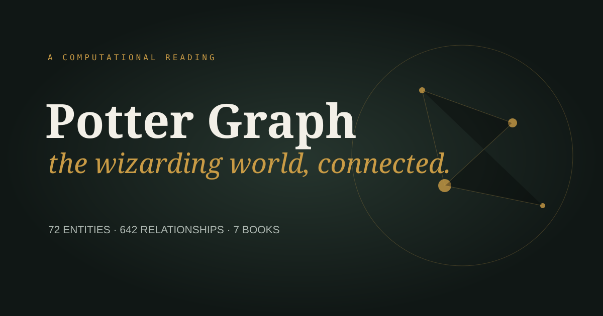
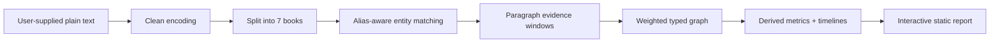

# Potter Graph

An interactive, evidence-backed map of the characters, places, spells, creatures,
and objects in the seven Harry Potter novels.

**[Open the report source](app/index.html)** ·
**[Record the 90-second demo](DEMO.md)**



## What is here?

Potter Graph converts a legally obtained plain-text corpus into a small,
browser-friendly knowledge graph. It answers questions such as:

- Which entities dominate each book, and when do they first appear?
- Which non-character entities bridge otherwise separate social circles?
- How does the use of named spells change through the series?
- What is the shortest narrative path between any two entities?
- Is a connection a one-off accident or a repeated relationship?

The report is intentionally exploratory: search for an entity, toggle entity
types, raise the minimum encounter threshold, select a node for its profile, or
select two nodes to compute their shortest path.

## A finding that surprised me

The most connected *non-character* entity is computed at runtime rather than
hard-coded. In the supplied extraction, **Hogwarts** acts as a stronger bridge
than any spell, creature, or magical object. That sounds obvious only after the
graph exposes it: Hogwarts is not merely a setting. Paragraph by paragraph, it
is the piece of narrative infrastructure that joins teachers, pupils, objects,
creatures, and magic that would otherwise form separate clusters.

The spell timeline reveals a second pattern: spell mentions are comparatively
sparse early in the series and become much denser as the conflict escalates.
The report lets the reader verify both claims rather than asking them to trust a
static chart.

## How it works



The graph is an adjacency-list-friendly JSON structure:

```json
{
  "nodes": [{
    "id": "Expecto Patronum",
    "type": "spell",
    "mentions": 31,
    "books": {"Prisoner of Azkaban": 16},
    "effect": "conjures a Patronus"
  }],
  "edges": [{
    "source": "Harry Potter",
    "target": "Expecto Patronum",
    "relation": "CO_OCCURS",
    "weight": 20,
    "confidence": 0.99,
    "books": {"Prisoner of Azkaban": 12}
  }]
}
```

An edge means that two entities share a paragraph in at least two separate
evidence windows. Its `weight` is the number of those windows. This definition
is intentionally modest: it means “narratively proximal,” not “friends,”
“speaker,” or “caster.” The UI uses weighted degree for bridge rankings and
breadth-first search for shortest paths.

## Run it

The committed report has no build step or runtime dependencies:

```bash
python -m http.server 8000
# open http://localhost:8000/app/
```

To reproduce the graph from your own lawful text copy:

```bash
python -m venv .venv
source .venv/bin/activate
pip install -r requirements.txt
python scripts/extract_graph.py /path/to/books.txt
python -m http.server 8000
```

The input may contain all seven books concatenated in publication order, with
standard `Harry Potter and the …` title lines. The source corpus is deliberately
gitignored: the repository distributes derived facts, not copyrighted prose.

Run the lightweight checks with:

```bash
python -m unittest discover -s tests
```

## Extraction approach: precision and recall

I chose a curated gazetteer with aliases, case-insensitive matching, and strict
word boundaries. It is less fashionable than an opaque LLM call, but it is
fast, deterministic, auditable, offline, and easy to discuss.

| Decision | Precision effect | Recall effect |
|---|---|---|
| Canonical names plus aliases (`Wormtail` → Peter Pettigrew) | Reduces duplicate nodes | Recovers nicknames |
| Word boundaries (`Ron` ≠ `ironically`) | Removes substring false positives | May miss malformed OCR |
| Paragraph co-occurrence | Usually captures one local event | Misses cross-paragraph relations |
| Minimum of two shared paragraphs | Suppresses incidental edges | Removes genuine one-off meetings |
| Curated entity inventory | Entity types are reliable | Long-tail entities are missed |

### Expected quality

For entity mentions, precision should be high for distinctive full names and
spells, and lower for ambiguous aliases such as “Harry” or “dragon.” Relation
precision depends on interpretation: co-occurrence itself is exact, but it is
only a proxy for interaction. Recall is deliberately bounded by the gazetteer.

A production evaluation would randomly sample 100 predicted mentions and 100
paragraphs, have two annotators label entities and genuine interactions, report
precision/recall/F1 with confidence intervals, and publish disagreements. The
current take-home avoids inventing metrics without a labelled gold set.

### Known limitations

- Pronouns are not resolved; “he” does not create a Harry mention.
- A paragraph mentioning two entities does not prove direct interaction.
- Ambiguous aliases can attach a mention to the wrong canonical entity.
- Spell effects are curated metadata, not inferred from nearby prose.
- The gazetteer favors important recurring entities over exhaustive recall.
- Different book editions and encodings can change paragraph boundaries.

## Design choices and core questions

**Why JSON rather than a graph database?**

The graph is small enough to ship to the browser. JSON makes the submission
portable and reviewable. The same nodes and edges can be imported into Neo4j or
NetworkX if the corpus grows.

**Why paragraphs?**

Sentence windows are precise but miss exchanges split across adjacent
sentences; chapters are too broad. Paragraphs are a useful, explainable middle
ground.

**Why not scrape Fandom for the final graph?**

The legacy repository did that, producing thousands of noisy, out-of-corpus
nodes. This solution answers the actual brief: entities evidenced in the books.

**Does confidence mean probability?**

No. It is a monotonic evidence score derived from repeated co-occurrence and
capped at 0.99. It helps rank/filter evidence; it is not calibrated probability.

**How would this scale?**

Stream paragraphs, use an Aho–Corasick matcher, store edges in a sparse table,
and precompute layouts server-side. For this corpus, the simple implementation
is easier to audit and already runs in seconds.

## Repository map

```text
app/
  index.html          interactive report
  style.css           responsive editorial UI
  app.js              canvas graph, filters, paths, insights
  data/graph.json     compact derived graph
scripts/
  extract_graph.py    deterministic extraction pipeline
tests/
  test_extract.py     matching and encoding checks
docs/
  preview.svg         repository preview
DEMO.md               concise recording script
```

## Attribution and ethics

Harry Potter and related names are trademarks of their respective owners. This
unofficial educational project is not affiliated with J. K. Rowling, Pottermore,
or Warner Bros. The repository does not include book text or lengthy excerpts.
Use only text you are legally entitled to process.
